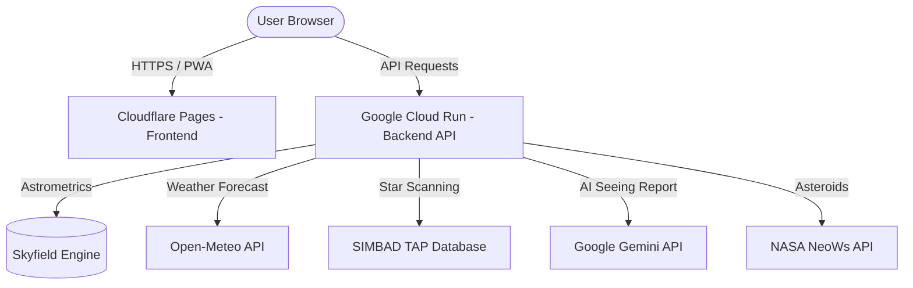

# ✨ StarGazer

<div align="center">
  <p><strong>A personal, distraction-free stargazing dashboard and astronomy portal for beginners.</strong></p>

  [](https://python.org)
  [](https://fastapi.tiangolo.com)
  [](https://developer.mozilla.org/en-US/docs/Web/JavaScript)
  [](https://pages.cloudflare.com)
  [](https://cloud.google.com/run)
  [](https://opensource.org/licenses/MIT)
  [](https://github.com/nicolasnkGH/stargazer/releases)

  <h3>
    <a href="https://stargazer.nick-t.net">🌐 View Live Demo</a>
    ·
    <a href="#-key-features">✨ Features</a>
    ·
    <a href="#-architecture">🏗️ Architecture</a>
    ·
    <a href="#-local-development">🛠️ Local Development</a>
  </h3>
</div>

---

## 🔭 Why StarGazer?
Getting started with amateur astronomy can be overwhelming. Commercial star charts and apps are packed with complex coordinates, grids, and settings that can deter beginners.

**StarGazer cuts through the noise.** It is a simple, elegant dashboard designed for the field that answers exactly what you need to know:
1. **Is it a good night to go outside?** (Evaluated using cloud forecasts & AI seeing models).
2. **What can I actually see?** (Dynamically filtered by your location's light pollution / Bortle Class).
3. **Where should I point my telescope or binoculars?** (Includes simple star-hopping directions, planet positions, and an interactive sky map).

---

## 🌟 Key Features

### 🌌 Observing & Targets
* **🌃 Dynamic Bortle Filtering:** Filters out faint, washed-out targets based on your current Bortle Class (1–9).
* **🎯 Curated Target Cards:** Focuses only on beginner-friendly "Must-See" deep-sky targets (Orion Nebula, Pleiades, Andromeda) with visual thumbnails and difficulty badges.
* **🔭 Optics Simulator & FOV Calculator:** Input your telescope's aperture and eyepiece focal length to compute magnification and simulate a realistic 1.2° Field of View (FOV) using Aladin Lite (DSS2 imagery).
* **🗺️ Constellation Explorer & Planetarium:** An interactive D3-based star map. Click on any star to query the professional astronomical **SIMBAD database** for live Spectral Type and Distance data.

### 🌤️ Weather & Astronomy Engines
* **🧠 AI Seeing Analysis:** Aggregates live cloud, humidity, temperature, and upper-atmosphere wind data to output a definitive "GO / NO GO" verdict via **Google Gemini 2.5 Flash**.
* **🪐 Planet Tracker:** Computes real-time altitude, azimuth, magnitude, constellation location, and light travel time for the naked-eye planets.
* **🛰️ Space Trackers:** Includes an **ISS Flyover Tracker** (predicts visible passes for the next 10 days), **Meteor Shower Monitor**, and a **NASA Near-Earth Object (NEO) Radar**.

### 📱 Premium UX & Design
* **🔴 Night Vision Mode:** A one-click toggle tinting the entire UI dark red to preserve your eyes' rhodopsin adaptation in the dark.
* **📱 Progressive Web App (PWA):** Install it directly to your home screen with offline caching.
* **🔔 Native Push Alerts:** Subscribe to native OS push notifications to get alerted when the ISS passes over or when skies clear.
* **🌍 100% Internationalized:** Localized in English, Spanish, and Portuguese.
* **🏎️ Lighthouse Optimized:** Performance optimized with lazy-loaded 3D WebGL scenes, compressed assets, and asynchronous CSS (Lighthouse scores: **84+ Performance, 96+ Accessibility**).

---

## 🏗️ Architecture



### 1. Frontend (`web/`)
* Built with 100% Vanilla HTML5, CSS3, and modern JavaScript.
* Zero build steps, bundlers, or heavy frameworks (No React, Webpack, or Vite).
* Uses **Three.js** for interactive 3D planet models, which are lazy-loaded via `IntersectionObserver` to save mobile battery and data.

### 2. Backend (`api/`)
* Lightweight **FastAPI** Python service.
* Runs inside Docker and scales automatically to zero on **Google Cloud Run** to minimize hosting costs.
* Fully automated CI/CD pipeline deploying via **GitHub Actions** on every push to `main`.

---

## 🛠️ Local Development

### 1. Run the Backend API
Ensure you have Python 3.11+ installed:

```bash
cd api
python3 -m venv venv
source venv/bin/activate
pip install -r requirements.txt
uvicorn main:app --host 0.0.0.0 --port 8181 --reload
```

The API docs will be available at `http://localhost:8181/docs`.

### 2. Run the Frontend
Serve the frontend using a basic local web server:

```bash
cd web
python3 -m http.server 8000
```

Open `http://localhost:8000`. The frontend will automatically detect the localhost environment and point its API requests to your local FastAPI backend.

---

## ⚙️ Environment Variables

The backend API reads the following variables (configured in your `.env` file locally or in the Cloud Run console):

| Variable | Description | Example / Default |
| :--- | :--- | :--- |
| `AI_API_KEY` | Google Gemini API Key | `AIzaSy...` |
| `NASA_API_KEY` | NASA Developer API Key (NEO Tracker) | `DEMO_KEY` |
| `OBSERVER_LAT` | Default latitude for fallback queries | `40.126` |
| `OBSERVER_LON` | Default longitude for fallback queries | `-83.037` |
| `OBSERVER_TIMEZONE` | Default timezone name | `America/New_York` |
| `VAPID_PUBLIC_KEY` | Public key for push notifications | *(Generate via pywebpush)* |
| `VAPID_PRIVATE_KEY` | Private key for push notifications | *(Generate via pywebpush)* |
| `VAPID_ADMIN_EMAIL` | Admin contact email for push server | `admin@example.com` |

---

## 📄 License
Distributed under the MIT License. See [LICENSE](LICENSE) for details.
