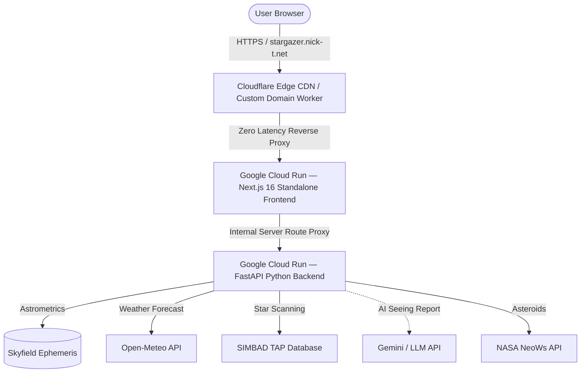

# 🌌 StarGazer v3.2.0 — Next.js 16 Observatory Portal

[](https://github.com/nicolasnkGH/stargazer/actions/workflows/pipeline.yml)
[](https://github.com/nicolasnkGH/stargazer/releases/tag/v3.2.0)
[](https://nextjs.org/)
[](https://stargazer.nick-t.net)
[](https://cloud.google.com/run)
[](LICENSE)

> A personal, distraction-free stargazing dashboard and astronomy portal powered by Next.js 16, React 19, Skyfield astrometrics, Cloudflare Edge Routing, and AI observer briefings.

---

## 🌟 What's New in v3.2.0 (Full i18n Localization & Translation Audit Suite)

**StarGazer v3.2.0** brings complete multi-language parity across English, Spanish, and Portuguese, localizing astronomical facts, ISS/Comet trivia, dynamic UI components, and introducing automated translation audit tooling.

### 🚀 Key v3.2.0 Major Features & Improvements:
- **🌐 1:1 Dynamic Multilingual Localization (EN / ES / PT):**
  - Expanded all translation dictionaries (`en.json`, `es.json`, `pt.json`) to 826+ synchronized keys across all 3 supported languages.
  - Localized all dynamic ISS and comet astronomy fun facts for full internationalization.
- **🛡️ Direct Message Fallback & Turbopack Cache Protection:**
  - Introduced client-side `IntlProvider` wrapper and direct locale dictionary lookup to eliminate missing message warnings and prevent raw key leakage during Turbopack dynamic code generation.
  - Safe translation guards added for Aurora risk levels, planetary facts, and observation checklist items.
- **🧪 Translation Integrity CLI & Git Hook Automation:**
  - Added CLI check tool `npm run check:i18n` (`scripts/check-translations.mjs`) that diffs locale dictionary files against `en.json` and flags missing keys.
  - Integrated Git pre-commit hooks to block commits if locale files become desynchronized.

---

## 🌟 What's New in v3.1.0 (Mobile Responsiveness & WebGL Simulator Update)

**StarGazer v3.1.0** introduces deep mobile layout enhancements, full Spanish/Portuguese localization coverage, onboarding flow fixes, and upgrades the interactive sky simulator to the modern WebGL-based Aladin Lite v3.

### 🚀 Key v3.1.0 Major Features & Improvements:
- **📱 Responsive Layout & Navigation Overhaul:**
  - Added visual scroll indicators, left/right scroll chevrons, and edge gradient masks to all scrollable sliders (observatory tabs, planet jump bar, constellations carousel, target database filters).
  - Telemetry strip condensed onto a dedicated mobile header, providing real-time conditions (seeing, cloud cover, moon phase, temperature, dew spread, local clock/date).
  - Integrated collapsible guide section for the Clear Outside weather widget to fit mobile viewports.
- **🔭 Upgrade to Aladin Lite v3 & WebGL Sky Simulator:**
  - Upgraded the Interactive Sky Simulator to use the modern, WebGL2-powered **Aladin Lite v3** library.
  - Removed old jQuery dependencies, fixing library initialization runtime crashes.
  - Simplified the simulator modal layout to present a clean, distraction-free astronomical database viewport.
- **🌐 Multilingual Translation System Coverage:**
  - Full translations for all newly added UI elements (onboarding tour dialogs, dashboard tabs, tooltips, weather conditions guides) across English, Spanish, and Portuguese.
- **🚀 Onboarding Tour Alignment:**
  - Aligned onboarding selectors (`#card-motion` and `#card-ai-targets`) with the guided driver.js steps, preventing runtime JS failures during the initial tutorial walk.

---

## 🌟 What's New in v3.0.0 (Next.js 16 Major Release)

**StarGazer v3.0.0** was a major architectural evolution migrating the codebase to **Next.js 16 (App Router)** while restoring 1:1 visual fidelity from the original prototype.

### 🚀 Key v3.0.0 Major Features & Improvements:
- **🪐 3D Solar System Orrery Hero Console:** Integrated 3D Three.js solar system model with D-Pad camera controls, quick planet jump deck, viewport-aware rendering pause, and smooth mouse/touch scroll passthrough.
- **⚡ Cloudflare Edge & Google Cloud Run Architecture:** Frontend (`stargazer-frontend`) and Backend (`stargazer-api`) run as scale-to-zero containers on Google Cloud Run, proxied via Cloudflare Global CDN & Worker Custom Domain routing for **100% $0.00/month** operating cost.
- **🌌 1:1 Vanilla Visual Fidelity & High-Res Textures:** Restored Bortle scale background texture (`bortle_scale_bg.webp`), glowing green aurora curtain background (`aurora_bg.webp`), and target DSO imagery.
- **🧁 HUD CRT Scanline & Glassmorphic AI Cards:** Restored 1:1 cyan & purple HUD scanline overlay with glowing borders for **Must-See & AI Picks** cards.
- **🔮 3D Planet Spheres with Astronomical Radial Color Glows:** Added planet-specific radial atmospheric glows (Sun, Mercury, Venus, Mars, Jupiter, Saturn, Uranus, Neptune) with 360° interactive drag rotation.
- **📊 Optimized Observing Hierarchy:** High-priority placement for Clear Outside Astronomical Weather Chart, Light Pollution Map, NASA APOD, and NOAA Aurora & Space Weather Forecast.
- **🔭 Target Database 1:1 Parity:** 2-column card grid, dynamic constellation tabs, magnitude badges, equipment/Bortle/difficulty tags, and centered purple `Load More Targets 🔭` pagination button (12 targets per chunk).
- **📍 Standalone Responsive Location Bar:** Fixed location pill positioning so `📍 Columbus (40.10°N, 83.08°W)` never collides with logos or menus on mobile.

---

## ✨ Features

### 🌌 Astronomical Engines & Live Sky Tracking
* **🔭 Target Database:** Browse 200+ deep-sky objects with dynamic magnitude filters, equipment compatibility (Seestar, DSLR, Binoculars, Telescope), and constellation tabs.
* **🪐 Planets Tonight:** Real-time 3D planetary positions, altitude/azimuth telemetry, distance, light travel time, and visual magnitude.
* **🌙 3D Moon Phase Widget:** Photorealistic 3D moon rendering with phase-driven sun lighting, illumination percentage, and lunar observation facts.
* **✨ Constellations Tonight:** Interactive 88-constellation sky viewer with live altitude progress bars, status badges (`🟢 High in sky`), and direction telemetry.
* **✨ Interactive Celestial Sky Map:** D3/Celestial sky map with `✨ Click to interact` scroll protection overlay and SIMBAD TAP object lookup.
* **🌤️ Clear Outside & Seeing Forecast:** Real-time atmospheric transparency, seeing score, dew risk alerts, and Clear Outside weather charts.
* **📅 7-Day Observing Outlook:** Weekly stargazing forecast with optimal sky window badges (`🌟 Excellent`, `🟢 Good`, `🟡 Fair`, `🔴 Poor`).
* **☄️ Objects in Motion:** Track visible ISS passes, active meteor showers, comets, and NASA Near-Earth Objects (NEOs).
* **🌌 NASA APOD:** Daily Astronomy Picture of the Day with high-resolution fallback.

### 📱 Premium UX & Performance
* **🏎️ Smart WebGL Viewport Throttling:** Three.js render loops automatically pause (`frameloop="never"`) when scrolled offscreen, preventing GPU/CPU spikes on mobile and desktop devices.
* **🔴 Night Vision Mode:** One-click toggle tinting the entire UI dark red to preserve your eyes' rhodopsin dark adaptation.
* **📱 Responsive Layout:** Optimized grid layouts dynamically scaled for mobile, tablet, and desktop viewports.
* **📱 Progressive Web App (PWA):** Serwist PWA service worker with offline caching.
* **🌍 100% Internationalized:** Localized in English, Spanish, and Portuguese via `next-intl`.

---

## 🏗️ Architecture


```mermaid
graph TD
    User([User Browser]) -->|HTTPS / stargazer.nick-t.net| CF[Cloudflare Edge CDN / Custom Domain Worker]
    CF -->|Zero Latency Reverse Proxy| CR_FE[Google Cloud Run — Next.js 16 Standalone Frontend]
    CR_FE -->|Internal Server Route Proxy| CR_BE[Google Cloud Run — FastAPI Python Backend]
    CR_BE -->|Astrometrics| SF[(Skyfield Ephemeris)]
    CR_BE -->|Weather Forecast| OM[Open-Meteo API]
    CR_BE -->|Star Scanning| SB[SIMBAD TAP Database]
    CR_BE -.->|AI Seeing Report| GM[Gemini / LLM API]
    CR_BE -->|Asteroids| NS[NASA NeoWs API]
```

### 1. Cloudflare Edge Layer (`stargazer.nick-t.net`)
* Serves as the primary public entry point with **Cloudflare Worker Custom Domain** reverse-proxy routing.
* Edge-caches static Next.js assets (`/_next/static/`), handles SSL termination, and provides free DDoS mitigation.

### 2. Frontend (`stargazer-frontend` on Google Cloud Run)
* Built with **Next.js 16** (App Router), **React 19**, **TypeScript**, **Three.js**, and **Tailwind CSS 4**.
* Configured with `output: "standalone"` running in a lightweight Docker container.
* Scales down to 0 instances when idle (**$0.00/month**).

### 3. Backend (`stargazer` / `stargazer-api` on Google Cloud Run)
* **FastAPI** Python service powering Skyfield astrometric ephemeris calculations.
* Scales down to 0 instances when idle (**$0.00/month**).

---

## 🛠️ Local Development & Deployment

### 1. Run full stack with Docker Compose
```bash
docker compose up --build
```
Opens at `http://localhost:3000` (Next.js frontend) and `http://localhost:8181` (Python API).

### 2. CI/CD Deployment Pipeline (`.github/workflows/pipeline.yml`)
* Automatically runs Playwright E2E UI smoke tests, Next.js build verification, and Python Bandit security scans.
* On merge to `main`, builds and deploys updated containers directly to **Google Cloud Run**.

---

## 🔄 Emergency Rollback Procedure

If issues ever occur in production, **StarGazer** includes an automated enterprise rollback mechanism built into the GitHub Actions pipeline:

### How to Trigger an Emergency Rollback:
1. Go to **GitHub Actions** $\rightarrow$ **CI/CD Pipeline**.
2. Click **Run workflow**.
3. Select **Operation to run**: `rollback`.
4. Enter **Tag to rollback to**: e.g., `v2.9.34` (or any known-good tag).
5. Enter **Rollback reason**: (e.g. *Rolling back to v2.9.34 due to production incident*).
6. Click **Run workflow**.

### What Happens Automatically:
- The pipeline verifies the release tag and checks out the known-good release state.
- Creates a dedicated branch (`rollback-YYYYMMDD-v2.9.34`) and automatically opens a **Rollback PR**.
- Merging the PR resets `main` to the target tag and triggers a clean re-deployment to Google Cloud Run with automated health check verification.

---

## 📄 License
Distributed under the MIT License. See [LICENSE](LICENSE) for details.
