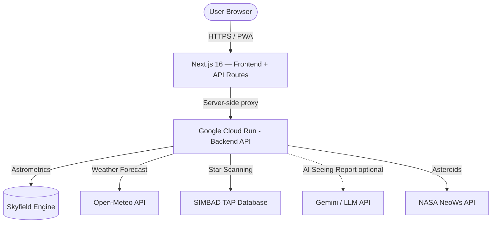

# ✨ StarGazer

<div align="center">
  <p><strong>A personal, distraction-free stargazing dashboard and astronomy portal for beginners.</strong></p>

  [](https://python.org)
  [](https://fastapi.tiangolo.com)
  [](https://nextjs.org)
  [](https://react.dev)
  [](https://cloud.google.com/run)
  [](https://opensource.org/licenses/MIT)
  [](https://github.com/nicolasnkGH/stargazer/releases)

  <h3>
    <a href="https://stargazer.nick-t.net">🌐 View Live Demo</a>
    ·
    <a href="#-key-features">✨ Features</a>
    ·
    <a href="#-architecture">🏗️ Architecture</a>
    ·
    <a href="#-local-development">🛠️ Local Development</a>
  </h3>
</div>

---

## 🔭 Why StarGazer?
Getting started with amateur astronomy can be overwhelming. Commercial star charts and apps are packed with complex coordinates, grids, and settings that can deter beginners.

**StarGazer cuts through the noise.** It is a simple, elegant dashboard designed for the field that answers exactly what you need to know:
1. **Is it a good night to go outside?** (Evaluated using cloud forecasts & optional AI seeing models — a rule-based fallback works without any API keys).
2. **What can I actually see?** (Dynamically filtered by your location's light pollution / Bortle Class).
3. **Where should I point my telescope or binoculars?** (Includes simple star-hopping directions, planet positions, and an interactive sky map).

---

## 🌟 Key Features

### 🌌 Observing & Targets
* **🌃 Dynamic Bortle Filtering:** Filters out faint, washed-out targets based on your current Bortle Class (1–9).
* **🎯 Curated Target Cards:** Focuses only on beginner-friendly "Must-See" deep-sky targets (Orion Nebula, Pleiades, Andromeda) with visual thumbnails and difficulty badges.
* **🔭 Optics Simulator & FOV Calculator:** Input custom telescope/eyepiece fields of view or select presets (Seestar S50, wide/telephoto DSLRs) to draw rectangular and circular FOV boundary overlays directly on the sky map.
* **📅 Plan My Night Timeline Scheduler:** Queue deep-sky targets, planets, and the Moon into a visual observing timeline. Reorder objects and export your session plan to Text or CSV files.
* **🗺️ Constellation Explorer & Planetarium:** An interactive D3-based star map. Filter through the 88 constellations instantly using the integrated **Constellation Search** bar. Click on any constellation to open rich discovery cards with mythology, Messier objects, best season, and bright-star highlights.

### 🌤️ Weather & Astronomy Engines
* **🧠 AI Seeing Analysis & Fallback Planner:** Aggregates live cloud, humidity, temperature, and upper-atmosphere wind data to output a definitive "GO / NO GO" verdict via **Google Gemini**. If AI is unavailable, the app transparently falls back to deterministic rule-based seeing scores.
* **📸 Community Gallery & Safe Uploads:** Visitors can share astrophotos via the UI. Images are compressed client-side before upload and pass through an AI safety verification step (optional, disabled when AI keys are absent).
* **🛠️ UI Robustness Improvements:** Improved the AI "Must-See & AI Picks" fallback behavior and fixed Add-to-Plan button handling so actions work reliably for dynamically injected content.
* **📅 Event of the Night Integration:** Automatically alerts you to major astronomical events happening tonight (e.g., meteor shower peaks, equinoxes, alignments) with a quick **"Add to Plan +"** action.
* **🪐 Planet Tracker:** Computes real-time altitude, azimuth, magnitude, constellation location, and light travel time for the naked-eye planets.
* **⚡ Aurora & Space Weather Monitor:** Displays planetary Kp-index readings, solar storm warnings, and active alert feeds in real-time from NOAA SWPC, predicting local aurora visibility probability.
* **☄️ 3D Interactive Solar System:** Embeds NASA's official 3D planetary orrery simulator.
* **🛰️ Space Trackers:** Includes an **ISS Flyover Tracker** (predicts visible passes for the next 10 days), **Meteor Shower Monitor**, and a **NASA Near-Earth Object (NEO) Radar**.

### 📱 Premium UX & Design
* **🔴 Night Vision Mode:** A one-click toggle tinting the entire UI dark red to preserve your eyes' rhodopsin adaptation in the dark.
* **📱 Responsive Target Grid:** Target database cards automatically scale and flow in a beautiful grid layout dynamically adjusted for mobile, tablet, and desktop viewports.
* **📱 Progressive Web App (PWA):** Install it directly to your home screen with offline caching.
* **🔔 Native & Local Push Alerts:** Subscribe to native OS push notifications for ISS passes, auroras, and clearing skies. Also schedules local PWA browser alerts exactly when scheduled observing targets rise.
* **🌍 100% Internationalized:** Localized in English, Spanish, and Portuguese.
* **🏎️ CI Performance Gated:** Lighthouse quality checks run in CI before deploy (with enforced performance/best-practices thresholds and accessibility warnings).

---

## 🏗️ Architecture


```mermaid
graph TD
    User([User Browser]) -->|HTTPS / PWA| NX[Next.js 16 — Frontend + API Routes]
    NX -->|Server-side proxy| CR[Google Cloud Run - Backend API]
    CR -->|Astrometrics| SF[(Skyfield Engine)]
    CR -->|Weather Forecast| OM[Open-Meteo API]
    CR -->|Star Scanning| SB[SIMBAD TAP Database]
    CR -.->|AI Seeing Report optional| GM[Gemini / LLM API]
    CR -->|Asteroids| NS[NASA NeoWs API]
```

### 1. Frontend (`nextjs-app/`)
* Built with **Next.js 16** (App Router), **React 19**, **TypeScript**, and **Tailwind CSS 4**.
* All API calls go through Next.js route handlers (`src/app/api/*/route.ts`) which proxy to the Python backend — the browser only ever talks to the same origin.
* Progressive Web App with offline support via **Serwist** (service worker).
* Internationalized in English, Spanish, and Portuguese via **next-intl**.
* Containerized with a multi-stage **Dockerfile** (`nextjs-app/Dockerfile`).

### 2. Backend (`api/`)
* Lightweight **FastAPI** Python service.
* Runs inside Docker and scales automatically to zero on **Google Cloud Run** to minimize hosting costs.
* Unified enterprise CI/CD via **GitHub Actions** using a single pipeline with validation, deploy, release, rollback, and manual dry-run modes.

### 3. CI/CD (`.github/workflows/pipeline.yml`)
* **Single source of truth workflow:** `Stargazer Enterprise Pipeline`.
* **Pre-deploy quality gates:** Next.js lint + build, Python lint/security, Playwright smoke tests, Lighthouse CI.
* **Safe deploy flow:** Deploy runs only after validation, then performs post-deploy `/health` checks with retries.
* **Release automation:** Auto patch-tag release on successful `main` pipeline runs; manual release supports explicit version or auto increment.
* **Rollback support:** Manual rollback creates a PR from a validated release tag.
* **Dry-run mode:** Manual dispatch can preview deploy/release actions without mutating production.

---

## 🛠️ Local Development

> 💡 **No API keys required!** The app runs with free public APIs by default. AI insights are optional — skip the AI setup if you just want a working stargazing dashboard.

### 1. Run the Backend API
Ensure you have Python 3.11+ installed:

```bash
cd api
python3 -m venv venv
source venv/bin/activate
pip install -r requirements.txt

# Run without AI keys (uses free Open-Meteo + rule-based scoring):
AI_API_URL="" AI_API_KEY="" NASA_APOD_KEY=DEMO_KEY uvicorn main:app --host 0.0.0.0 --port 8181 --reload

# Or with your own Gemini API key for AI insights:
# AI_API_KEY=your_key uvicorn main:app --host 0.0.0.0 --port 8181 --reload
```

The API docs will be available at `http://localhost:8181/docs`.

### 2. Run the Frontend
```bash
cd nextjs-app
npm install
npm run dev
```

Opens at `http://localhost:3000`. The Next.js API routes automatically proxy to the backend at `http://localhost:8181` (configurable via `API_BACKEND`).

### 3. Run with Docker Compose (full stack)
```bash
docker compose up --build
```

This starts the Python API (`localhost:8181`), the Next.js frontend (`localhost:3000`), and Redis.

---

## ⚙️ Environment Variables

The backend API reads the following variables (configured in your `.env` file locally or in the Cloud Run console).

> **🔒 Security:** This repository contains **no API keys or secrets**. All API keys below must be supplied by **you** in your own `.env` file or deployment environment. Never commit `.env` files.

### Frontend (Next.js)

| Variable | Description | Default |
| :--- | :--- | :--- |
| `API_BACKEND` | URL of the Python backend, used by Next.js route handlers (server-side only) | `http://localhost:8181` |

### Required for Core Functionality (No API Keys Needed)
The app works **without any AI or third-party API keys** — it falls back to free public APIs:

| Variable | Description | Default |
| :--- | :--- | :--- |
| `OBSERVER_LAT` | Default latitude | `40.0638` |
| `OBSERVER_LON` | Default longitude | `-83.0457` |
| `OBSERVER_TIMEZONE` | Default timezone name | `America/New_York` |
| `OBSERVER_ELEVATION_M` | Elevation in meters | `250` |
| `TELESCOPE_APERTURE_MM` | Telescope aperture | `130` |
| `TELESCOPE_FOCAL_MM` | Telescope focal length | `650` |
| `DB_DIR` | Path to SQLite database directory (Cloud Run: `/mnt/db`) | `../` |

### Optional: AI Insights (Extra Feature)
> 🧠 **AI insights are optional.** If you don't set these, the app uses **rule-based scoring** from free public weather data (Open-Meteo) and works perfectly fine. Only set these if you want AI-generated seeing commentary.

| Variable | Description | Example |
| :--- | :--- | :--- |
| `AI_MODEL` | AI model name (Gemini, GPT-4, Qwen, etc.) | `gemini-2.5-flash` |
| `AI_API_URL` | AI API endpoint URL | `https://generativelanguage.googleapis.com/v1beta/openai/chat/completions` |
| `AI_API_KEY` | Your AI provider's API key | `AIzaSy...` |
| `AI_TIMEOUT` | Timeout in seconds before falling back to rules | `60` |
| `FALLBACK_AI_API_URL` *(optional)* | Backup AI endpoint | |
| `FALLBACK_AI_MODEL` *(optional)* | Backup AI model | |
| `FALLBACK_AI_API_KEY` *(optional)* | Backup AI API key | |

**How it works:** When AI vars are unset, the API returns `ai_powered: false` and the frontend gracefully shows "📐 Rule-based" with all core weather charts and seeing scores intact. No errors, no setup friction.

### Optional: Push Notifications
| Variable | Description |
| :--- | :--- |
| `VAPID_PUBLIC_KEY` | Public key for push notifications |
| `VAPID_PRIVATE_KEY` | Private key for push notifications |
| `VAPID_ADMIN_EMAIL` | Admin contact email |

### Optional: NASA APIs (Free Tier Available)
| Variable | Description | Default |
| :--- | :--- | :--- |
| `NASA_APOD_KEY` | NASA API key for Astronomy Picture of the Day | `DEMO_KEY` (free, 30 req/hr) |

### CI/CD Configuration (GitHub Actions)

The Cloud Run pipeline is fully configuration-driven. Store deploy/runtime values in GitHub **Variables** and **Secrets**.

GitHub **Variables**:

- `GCP_SERVICE_NAME`
- `GCP_REGION`
- `GCP_SOURCE_DIR`
- `CLOUD_RUN_EXECUTION_ENV`
- `CLOUD_RUN_DB_VOLUME`
- `CLOUD_RUN_DB_BUCKET`
- `CLOUD_RUN_DB_MOUNT_PATH`
- `FALLBACK_AI_API_URL` *(optional)*
- `FALLBACK_AI_MODEL` *(optional)*
- `AI_TIMEOUT`

GitHub **Secrets**:

- `GCP_SA_KEY`
- `AI_MODEL`
- `AI_API_URL`
- `AI_API_KEY`
- `CF_ACCESS_CLIENT_ID`
- `CF_ACCESS_CLIENT_SECRET`
- `FALLBACK_AI_API_KEY` *(optional)*

---

## 📄 License
Distributed under the MIT License. See [LICENSE](LICENSE) for details.
